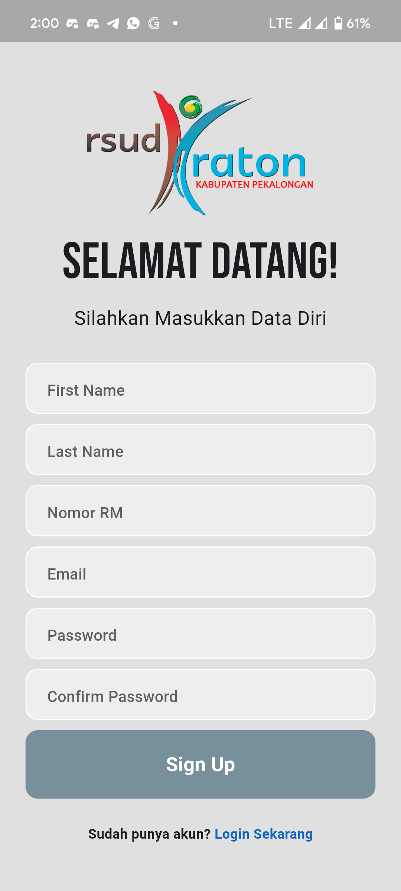

# [TA] Aplikasi-berbasis-mobile-untuk-distribusi-riwayat-hasil-pemeriksaan-laboratorium

## Repository ini adalah untuk menyimpan kode hasil TA yaitu aplikasi berbasis mobile untuk distribusi dan riwayat hasil pemeriksaan laboratorium menggunakan metode RAD di RSUD Kraton Pekalongan

### Screenshots
- Login
- 
- Register
- 
- Home
- 
- Tampil Hasil
- 
- Tampil Grafik
-  

### Screenshots (Lab Admin Side)
- Login
- Home
- Upload Screen
